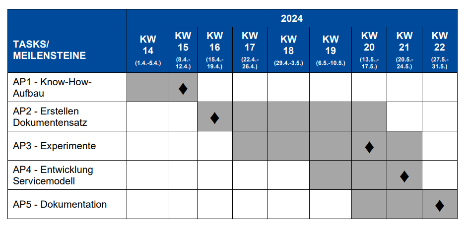

# Welcome, Accessibility Buddies!

This is the repo for our work as part of [Update Social](https://updatesocial.org/)

## Organisational

### Links

We'll want to connect important links to resources we consult regularly.

* [Update Social Lecture List](https://www.jku.at/lit-open-innovation-center/open-innovation-in-science/lehre-und-weiterbildung/updatesocial/)

### Original Project Plan

From the community call (DE) -

Text in EN:

* **Milestone 1**: Know-How, April 1 - 12 (**Milestone week of Monday, April 8**)
* **Milestone 2**: Documentset, April 15 - May 17 (**Milestone week of Monday, April 15**)
* **Milestone 3**: Experiments, April 22 - May 24 (**Milestone week of Monday, May 13**)
* **Milestone 4**: Service Model, May 6 - May 24 (**Milestone week of Monday, May 20**)
* **Milestone 5**: Documentation, May 13 - 31 (**Milestone week of Monday, May 27**)

**In terms of responsibility and accountability, how about a task-manager model where each project group member takes charge of a Milestone?** (Minus know-how since this is task specific, minus documentation since this pertains to everything and the final presentation, plus the practical prototype, which is something Jack is trying to do: let's discuss soon!) Service model might particularly relevant to the presentation and could draw on the other tasks, since the final presentation will take place in a JKU (Johannes Kepler University) context.

If we want to do this: **TODO**

* Aida: *TODO*
* Amogh: *TODO*
* Jack: *TODO*
* Marcel: *TODO*

### Current Project Plan

Changes are usually likely. Updates to the plan will follow here.

### Meeting Agenda

**How about coffee-fueled get-togethers in KHG (Katholische Hochschulgemeinde) in accordance with the Milestones, say Wednesdays?**

### Documents-Management

Let's keep this repo as the main source of truth! (This would be an anti-tool-proliferation experiment - have you noticed this trend? One thing we do have to think about then is how to mark and track **TODO**s - are text files and bold face enough?) Git branching and merging optional if you feel comfortable.

### Editing-Privileges

The same for all group members.

### Blog

We might like to run a blog from this repo to publish elsewhere, but we'll discuss that soon.

## The Work

Now it gets interesting: **Proposed organisation of this section: like task and repo structure, document set, experiments, practical prototype and finally, service model.**

## Final Presentation and other Events

Most importantly (don't be afraid, let's have fun and invite everyone) -

### Celebrating Communities

**June 5, 5 - 7 PM**

Capstone Event at LIFT_C “Summer Get Together.”

#### Invitations

Everyone, of course, but as a specific **TODO**: I'd say we invited KHG as another community? Any others we can think of? "Cross-community learning," maybe? Raphael, also at KHG, is a JKU LIO (Leading Innovative Organizations) student and has so much to say about this topic, maybe he'd be interested in a collaboration on thinking about communities in general, if this is something we are interested in.

### Other Events: Maybe an IIS (Institute of Integrated Study) Get-Together

We should make sure we stay connected as this project comes from this group and they are happy to help and can give us all the important inputs. Not to make things too complicated, but FAW (Institute for Applied Knowledge Processing) and IML (Machine Learning) at JKU might also be interested as the Jack's Masters thesis that this project intersects with is situated at these three institutes.

## Further

### Resources (Links)

Document-resources in /reading please - own docs in /project-docs.

* [Gerhard Nussbaum on disability and accessibility (accessible documents are for disabled persons in general, including blind persons)](https://www.axes4.com/de/blog/post/2024/checkliste-vorbereitung-fuer-pdf-export-mit-axesslide)

### Language

It might be helpful to collect German (DE) and English (EN) language references for currently appropriate and helpful words to use when talkbing about disability, accessibility and also documents, i.e. the technology relating to making documents accessible. **Does someone want to take this?**