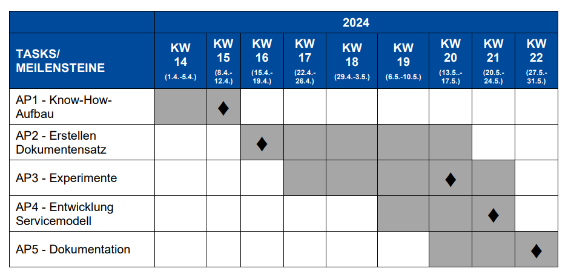

# Welcome, Accessibility Buddies!

This is the repo for our work as part of [Update Social](https://updatesocial.org/)

## Organisational

### Links

We'll want to connect important links to resources we consult regularly.

* [Update Social Lecture List](https://www.jku.at/lit-open-innovation-center/open-innovation-in-science/lehre-und-weiterbildung/updatesocial/)

### Original Project Plan

From the community call (DE) -

Text in EN:

* **Milestone 1**: Know-How, April 1 - 12 (**Milestone week of Monday, April 8**)
* **Milestone 2**: Documentset, April 15 - May 17 (**Milestone week of Monday, April 15**)
* **Milestone 3**: Experiments, April 22 - May 24 (**Milestone week of Monday, May 13**)
* **Milestone 4**: Service Model, May 6 - May 24 (**Milestone week of Monday, May 20**)
* **Milestone 5**: Documentation, May 13 - 31 (**Milestone week of Monday, May 27**)

### Current Project Plan

Changes are usually likely. Updates to the plan will follow here.

### Meeting Agenda

**How about coffee-fueled get-togethers in KHG (Katholische Hochschulgemeinde) in accordance with the Milestones, say Wednesdays?**

### Documents-Management

Let's keep this repo as the main source of truth! Code goes into /prototype, all other directories are docs.

### Editing-Privileges

The same for all group members.

### Blog

We might like to run a blog from this repo to publish elsewhere, but we'll discuss that soon.

## The Work

Now it gets interesting.

### Resources (Links)

Document-resources in /reading please - own docs in /project-docs.

* [Gerhard Nussbaum on disability and accessibility (accessible documents are for disabled persons in general, including blind persons)](https://www.axes4.com/de/blog/post/2024/checkliste-vorbereitung-fuer-pdf-export-mit-axesslide)

### Language

It might be helpful to collect German (DE) and English (EN) language references for currently appropriate and helpful words to use when talkbing about disability, accessibility and also documents, i.e. the technology relating to making documents accessible. **Does someone want to take this?**