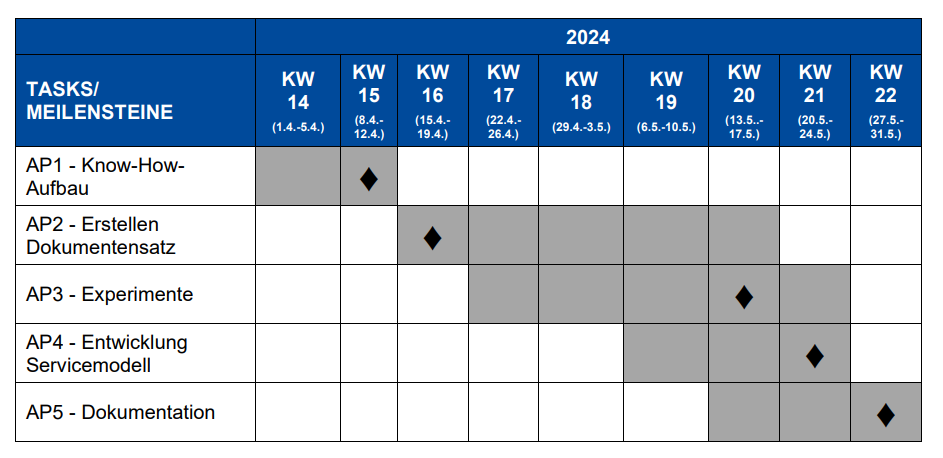
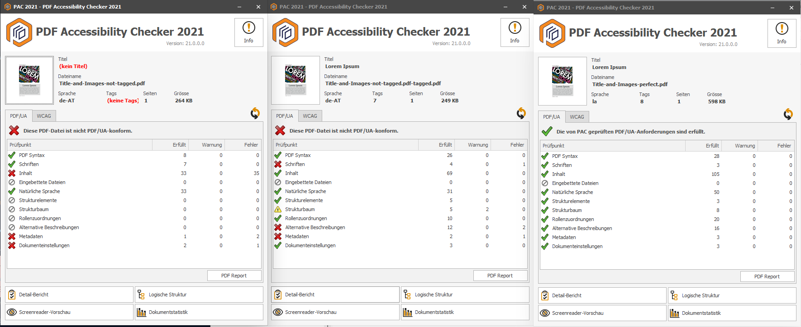
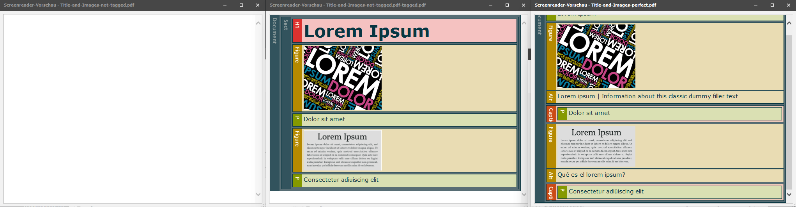

# Accessibility Buddies

[Barrierefreie PDF-Dokumente erstellen](Barrierefreie%20PDF-Dokumente%20erstellen%20a0e9b1ec8af8404c9858b5dfb10bdef6.md)

[Ressources](Ressources%202c03001e500a4f6bbb8dc7899945c1cc.md)

# Organisation and Summary

| Week | Activities               |
|------|--------------------------|
| KW14 | -                        |
| KW15 | 1st Lecture              |
| KW16 | Books, 1st Zoom Meeting  |
| KW17 | Books, QPDF, Llama3 API  |
| KW18 | Buch Lesen               |
| KW19 | Source Code, Buch Lesen  |
| KW20 | Source Code, Buch Lesen  |
| KW21 | Ressourcen, Buch Summary |
| KW22 | Buch Summary             |

## KW17:

- Install PQDF
- Input PDF to LLMs
- Transform PDF
- Image descriptor for captions

## KW19:

- PAC - checks for accessibility
    - [https://pdfua.foundation/de/pac-2021-der-kostenlose-pdf-accessibility-checker/](https://pdfua.foundation/de/pac-2021-der-kostenlose-pdf-accessibility-checker/)
- Code Diff shows very different documents of qpdf outputs. not just tags
    - [https://www.w3docs.com/tools/code-diff/](https://www.w3docs.com/tools/code-diff/)
    - QPDF
- llama3-gradient has a context length of 1M, we could use this
    - [https://ollama.com/library/llama3-gradient](https://ollama.com/library/llama3-gradient)
- Adobe autotagger:
    
    
    
    
    
    - [https://developer.adobe.com/document-services/docs/overview/pdf-accessibility-auto-tag-api/quickstarts/python/](https://developer.adobe.com/document-services/docs/overview/pdf-accessibility-auto-tag-api/quickstarts/python/)

> It's not impossible. However, it requires both C++ programming skills and a very deep knowledge of PDF internals: the graphics model, the text model and the tagging model, which all interact. If you have that (or the time to study) you can use the PDSEdit layer in a custom plug-in.
> 
> 
> Bear in mind that identifying "headers, sub headers, lists, forms, tables" is all guesswork. These things are not marked in a different way, pre-tagging. A table is a mixture of lines and text which the human eye quickly recognises as having patterns that make it a table. If you are working with highly standardised documents this is much easier.
> 
> By the way, Adobe's accessibility checker is not considered the industry standard for good accessibility; if you go to this trouble you should probably aim higher.
> 

- Patricia & Jack liked the quote about the bridge and accessible PDF
    
    > Markus Erle, in Fachkreisen anerkannter Experte für barrierefreie PDFs, hat eine schöne Analogie dafür geschaffen, was das Fehlen bestimmter Kriterien für barrierefreie Inhalte bedeutet: Angenommen, Sie wollen über eine Hängebrücke gehen, die einen tiefen Abgrund überquert, und unten befindet sich ein Fluss, in dem Krokodile schwimmen. Ist die Brücke intakt, sollte eine Überquerung problemlos möglich sein - in Übertragung der problemfreie, uneingeschränkte Zugang zu einem Dokument. Fehlt sichtbar eine Latte (ein Kriterium für ein barrierefreies Dokument ist nicht erfüllt), sind Sie vielleicht leicht skeptisch, aber eine Überquerung wird mit leicht flauem Magen dennoch möglich sein - wenn Sie aber Pech haben, erwischen Sie die Lücke. Noch kritischer wird es, wenn mehrere Latten fehlen. Verteilen sich diese Lücken gleichmäßig, so mag auch das noch gut gehen auch wenn die Chancen für einen Absturz rapide steigen. Fehlen mehrere Latten am Stück, kann eine Überquerung unmöglich sein - das Dokument ist nicht zugänglich, obwohl vielleicht viele Kriterien für ein barrierefreies Dokument erfüllt sind. Da hilft es auch nicht, wenn die vorhandenen Latten auch Hochglanz poliert sind, also einzelne Kriterien mit Bravour erfüllt oder gar übererfüllt sind. (S. 45)
    >